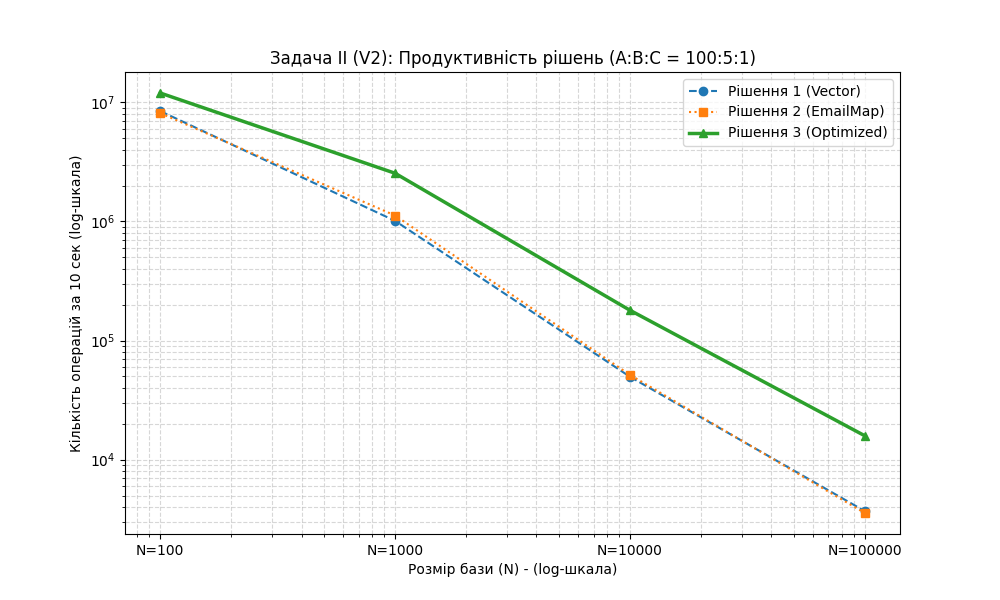
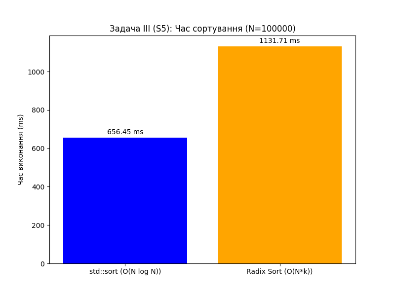

# Домашнє завдання №1: Структури та Сортування

Звіт по першій лабораторній роботі.

Метою було реалізувати дві задачі:
1.  **Задача II (Варіант V2):** Створити оптимальну структуру даних для бази студентів, враховуючи співвідношення операцій A:B:C = 100:5:1 (тобто, пошук за ДН — найчастіший).
2.  **Задача III (Варіант S5):** Порівняти ефективність `std::sort` та `Radix Sort` для сортування студентів за полем `m_group`.

---

## 🛠️ Як зібрати і запустити

Проєкт використовує систему збірки **CMake**.

1.  Переконатися, що `CMake` та C++ компілятор (MinGW/MSVC) встановлені.
2.  Створити папку `build` і перейти в неї:
    ```bash
    mkdir build
    cd build
    ```
3.  Виконати команди CMake для генерації та збірки проєкту:
    ```bash
    cmake ..
    cmake --build .
    ```
4.  **Важливо:** Перед запуском покласти файл `students.csv` у ту саму папку, де знаходиться `main.exe` (зазвичай це `build/Debug` або просто `build`).
5.  Запустити програму:
    ```bash
    .\main.exe
    ```

---

## 📊 Задача II (V2): Аналіз 3-х рішень

Для аналізу було реалізовано 3 підходи:
* **Рішення 1:** `std::vector` (базовий). Усі операції O(N).
* **Рішення 2:** `vector` + `unordered_map<email, Student*>` (оптимізація операції B). Операція A залишається O(N).
* **Рішення 3:** `vector` + `map<email, ...>` + `map<birthday, ...>` (оптимізація A і B). Операції A і B — O(1).

### 1. Продуктивність (Кількість операцій за 10 сек)

Тестування проводилось на 10 секунд для кожного рішення при різному розмірі бази (N).

| Розмір (N) | Рішення 1 (`vector`) | Рішення 2 (`email_map`) | Рішення 3 (Оптимальне) |
| :--- | :--- | :--- | :--- |
| **100** | 8,438,250 | 8,113,250 | 11,974,057 |
| **1000** | 1,011,351 | 1,121,248 | 2,537,788 |
| **10000** | 49,689 | 51,537 | 179,640 |
| **100000** | 3,699 | 3,567 | 15,875 |

**Графік залежності продуктивності від розміру бази (N):**



**Висновки по продуктивності:**
Графік та таблиця чітко показують, що Рішення 1 і 2 катастрофічно деградують. Це логічно, оскільки найчастіша операція (A=100) у них має складність O(N). Рішення 3, яке оптимізує цю операцію до O(1), демонструє в **~4.4 рази** кращий результат на 100k рядків.

### 2. Використання пам'яті

Вимірювання проводились через Диспетчер завдань під час 10-секундного тесту.

**(ТУТ ТОБІ ТРЕБА ВСТАВИТИ СВОЇ ЦИФРИ З ДИСПЕТЧЕРА)**
| Розмір (N) | Рішення 1 (Пам'ять, МБ) | Рішення 2 (Пам'ять, МБ) | Рішення 3 (Пам'ять, МБ) |
| :--- | :--- | :--- | :--- |
| **100** | 10Mb | 10Mb |10Mb  |
| **1000** | 11Mb | 11Mb | 11Mb |
| **10000** | 14Mb | 15Mb | 16Mb |
| **100000** | 32Mb | 42Mb | 45Mb |

**Висновки по пам'яті:**
Як видно з таблиці, різниця у споживанні пам'яті **незначна**. Це пояснюється тим, що основний об'єм (95%+) займає сам `std::vector<Student>`, а додаткові хеш-таблиці в Рішенні 3 зберігають лише вказівники та ключі, а не копії об'єктів.

**Загальний висновок по Задачі II:** Рішення 3 є оптимальним, оскільки дає величезний приріст у швидкодії ціною незначного збільшення витрат пам'яті.

---

## 📈 Задача III (S5): Аналіз сортування

**Мета:** Посортувати 100,000 студентів за полем `m_group`.

Було реалізовано два підходи:
1.  **`std::sort`:** Стандартна C++ функція, складність O(N log N).
2.  **`Radix Sort`:** Порозрядне сортування (LSD), адаптоване для рядків фіксованої довжини (k=6). Теоретична складність O(k\*N), тобто O(N).

**Результати тестування (N = 100,000):**

* **`std::sort` час:** 656.45 ms
* **`Radix Sort` час:** 1131.71 ms

**Графік порівняння часу сортування:**



**Висновки по сортуванню:**
Експеримент показав, що `std::sort` виявився **майже в 1.7 раза швидшим** за `Radix Sort`, попри гіршу асимптотичну складність.

Причина в **практичній реалізації**. `std::sort` — це надзвичайно оптимізована функція. Наша реалізація `Radix Sort` хоч і має складність O(N), але вона вимагає **6 повних проходів** по масиву (k=6), і на кожному проході **створює копію** всього масиву `std::vector<Student> output(n)`. Ці величезні накладні витрати на копіювання 100,000 об'єктів 6 разів виявилися набагато "дорожчими", ніж швидкі порівняння "на місці", які робить `std::sort`.
